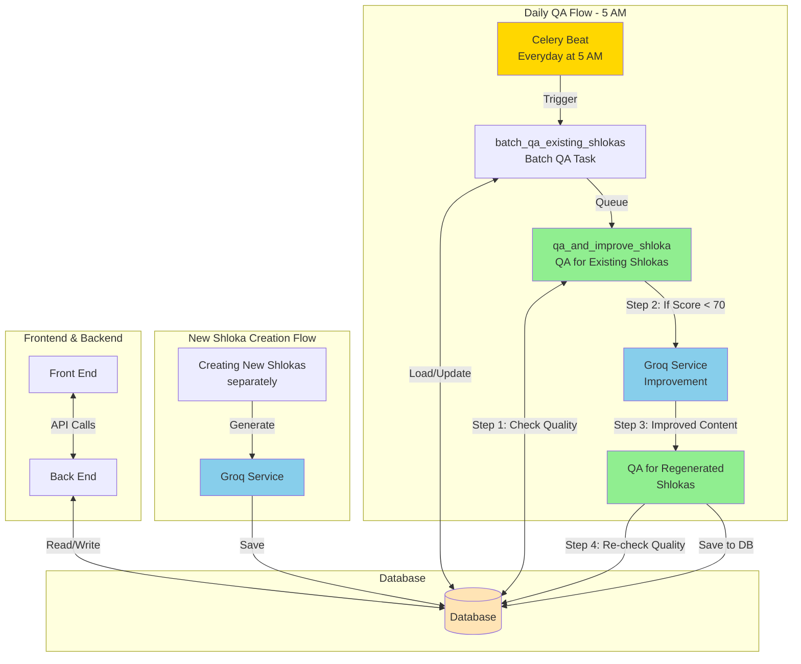
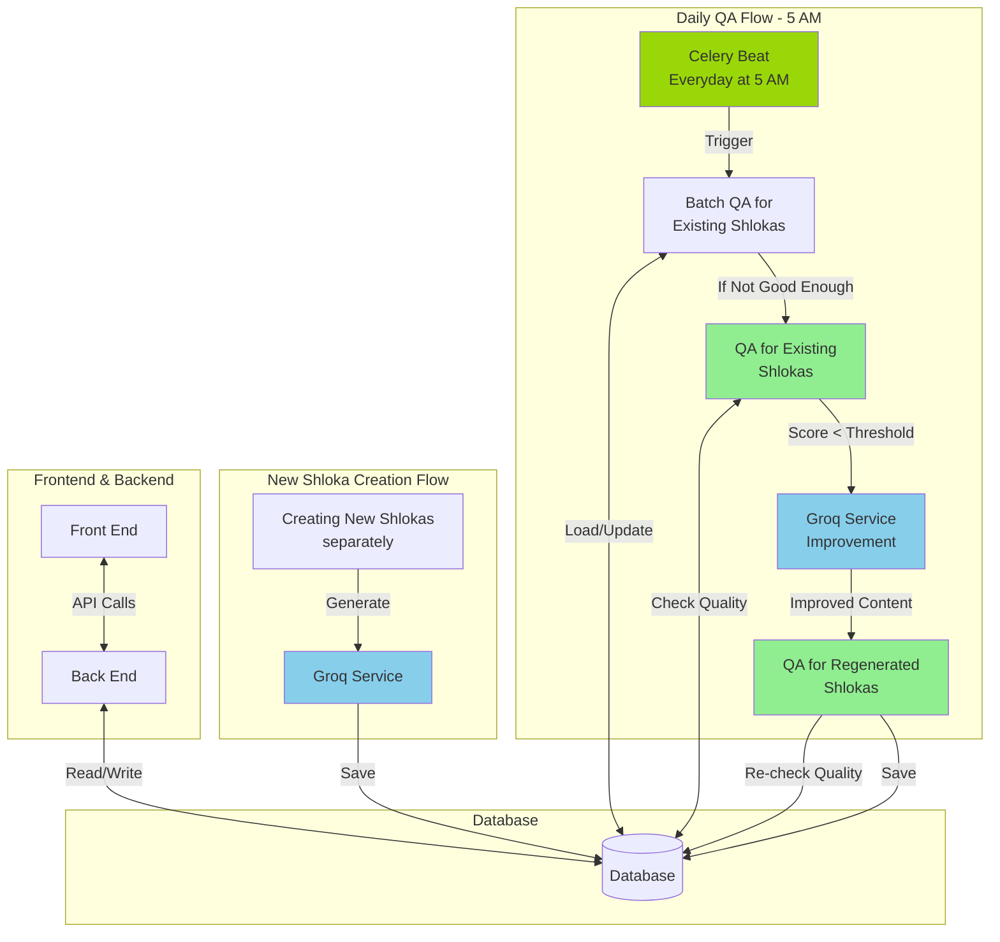
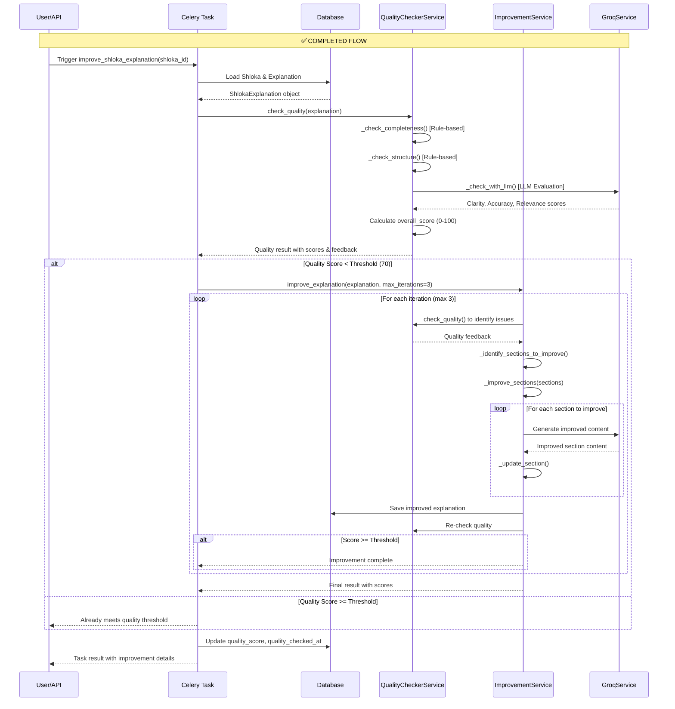
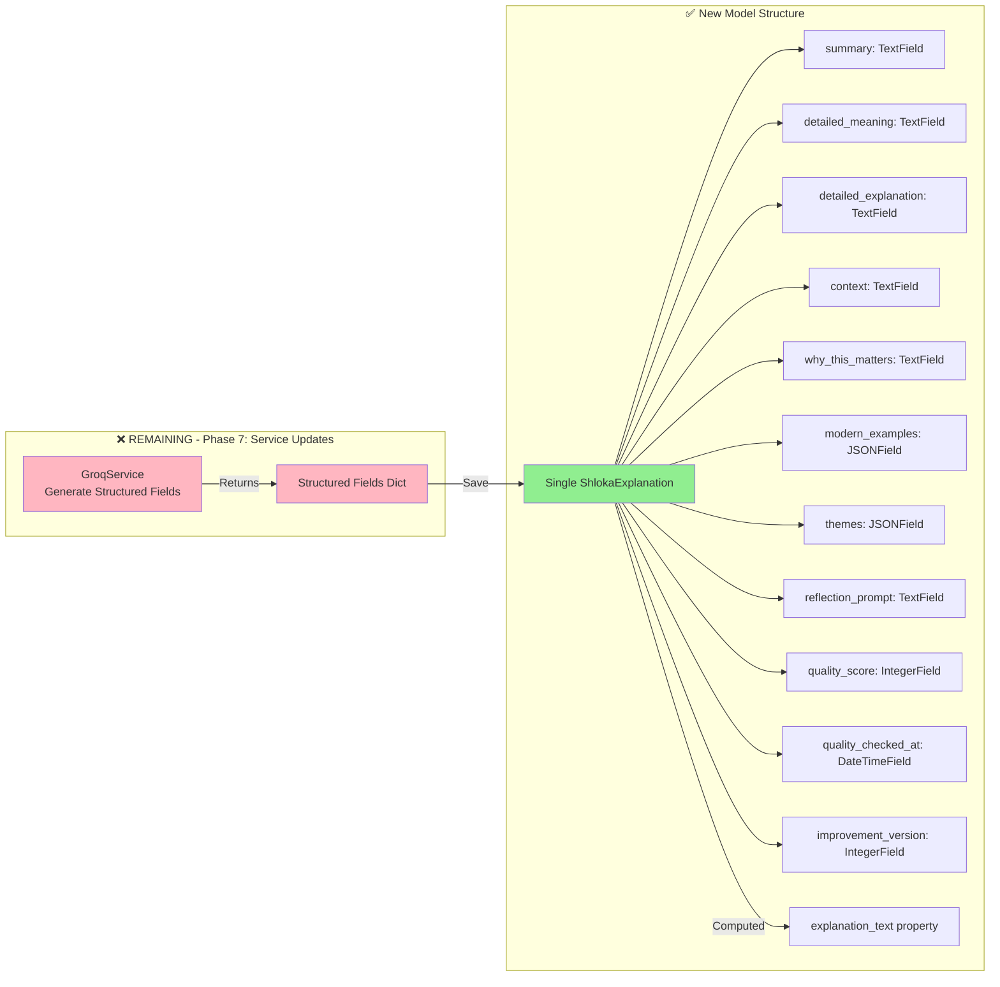
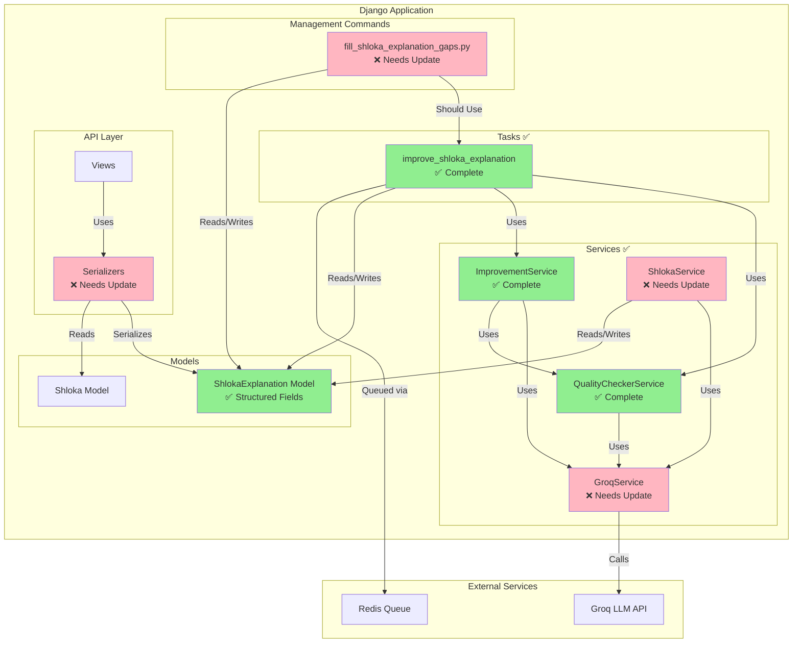

# Shloka Explanation Quality Improvement - Architecture Diagram

## Main Architecture Flow (As Designed)

This matches the architecture diagram you provided:

**Key Flow:**
1. **New Shlokas**: Created separately → Groq generates → Saved to DB
2. **Daily QA (5 AM)**: 
   - Celery Beat triggers batch QA
   - For each shloka: QA check → If low quality → Groq improvement → QA again → Save

## System Architecture Overview (Detailed)

### Main Architecture Flow (As Designed)

## System Architecture Overview (Detailed)

```mermaid
graph TB
    subgraph "✅ COMPLETED - Phase 1: Data Model"
        Model[ShlokaExplanation Model]
        Model --> |Structured Fields| Fields[summary, detailed_meaning,<br/>detailed_explanation, context,<br/>why_this_matters, modern_examples,<br/>themes, reflection_prompt]
        Model --> |Quality Tracking| Quality[quality_score,<br/>quality_checked_at,<br/>improvement_version]
        Model --> |Computed Property| Prop[explanation_text property<br/>generates full text on-demand]
    end

    subgraph "✅ COMPLETED - Phase 2: Celery Setup"
        CeleryApp[Celery App]
        CeleryApp --> |Broker| Redis[Redis/RabbitMQ]
        CeleryApp --> |Result Backend| ResultBackend[Result Backend]
        CeleryApp --> |Auto-discover| Tasks[Tasks Module]
    end

    subgraph "✅ COMPLETED - Phase 3: Quality Checking"
        QCS[QualityCheckerService]
        QCS --> |Rule-based| Completeness[Completeness Check<br/>0-25 points]
        QCS --> |Rule-based| Structure[Structure Check<br/>0-10 points]
        QCS --> |LLM-based| LLMCheck[LLM Evaluation<br/>via GroqService]
        LLMCheck --> Clarity[Clarity Score<br/>0-25 points]
        LLMCheck --> Accuracy[Accuracy Score<br/>0-25 points]
        LLMCheck --> Relevance[Relevance Score<br/>0-15 points]
        Completeness --> Overall[Overall Score<br/>0-100]
        Structure --> Overall
        Clarity --> Overall
        Accuracy --> Overall
        Relevance --> Overall
    end

    subgraph "✅ COMPLETED - Phase 4: Improvement System"
        IS[ImprovementService]
        IS --> |Identify| Identify[Identify Sections<br/>to Improve]
        IS --> |Improve| Improve[Improve Sections<br/>via GroqService]
        IS --> |Iterate| Iterate[Max 3 Iterations<br/>Track improvement_version]
        Improve --> |Targeted Prompts| Groq[GroqService<br/>LLM API]
    end

    subgraph "✅ COMPLETED - Phase 5: Celery Tasks"
        Task1[improve_shloka_explanation Task]
        Task1 --> |1. Load| Load[Load Shloka &<br/>Explanation]
        Load --> |2. Check| Check[Check Quality<br/>QualityCheckerService]
        Check --> |3. If Low| ImproveTask[Improve Explanation<br/>ImprovementService]
        ImproveTask --> |4. Re-check| ReCheck[Re-check Quality]
        ReCheck --> |5. Save| Save[Save Updated<br/>Explanation]
        
        Task2[check_shloka_quality Task<br/>✅ NEW]
        Task2 --> |Check Only| CheckOnly[Check Quality<br/>Update Score]
        
        Task3[batch_check_shlokas_quality Task<br/>✅ NEW]
        Task3 --> |Queue| BatchCheck[Multiple Check Tasks]
        
        Task4[batch_improve_shlokas Task<br/>✅ NEW]
        Task4 --> |Queue| BatchImprove[Multiple Improve Tasks]
        
        Beat[Celery Beat Scheduler<br/>✅ NEW]
        Beat --> |Daily| Task3
        Beat --> |Weekly| Task4
        Beat --> |Monthly| Task3
        
        Task1 --> |Retry Logic| Retry[Exponential Backoff<br/>Max 3 retries]
        Task2 --> |Retry Logic| Retry
    end

    subgraph "❌ CANCELLED - Phase 6: Data Migration"
        Note1[No Migration Needed<br/>Creating Fresh Explanations Only]
    end

    subgraph "❌ REMAINING - Phase 7: Service Updates"
        GroqService[GroqService]
        GroqService --> |Update| UpdateGroq[Return Structured<br/>Fields Directly]
        ShlokaService[ShlokaService]
        ShlokaService --> |Update| UpdateShloka[Work with<br/>Structured Fields]
        Serializer[ExplanationSerializer]
        Serializer --> |Update| UpdateSerializer[Include Structured<br/>Fields + explanation_text]
    end

    subgraph "❌ REMAINING - Phase 8: Management Command"
        Cmd[fill_shloka_explanation_gaps.py]
        Cmd --> |Update| UpdateCmd[Remove summary/detailed<br/>Use Celery Tasks<br/>Check/Improve Quality]
    end

    %% Flow connections
    Task -.->|Uses| QCS
    Task -.->|Uses| IS
    IS -.->|Uses| QCS
    IS -.->|Uses| Groq
    QCS -.->|Uses| Groq

    style Model fill:#90EE90
    style CeleryApp fill:#90EE90
    style QCS fill:#90EE90
    style IS fill:#90EE90
    style Task fill:#90EE90
    style Migrate fill:#FFB6C1
    style GroqService fill:#FFB6C1
    style ShlokaService fill:#FFB6C1
    style Serializer fill:#FFB6C1
    style Cmd fill:#FFB6C1
```

## Detailed Flow Diagram

## Data Flow Diagram

## Component Interaction Diagram

## Summary

### ✅ Completed (Phases 1-5)
1. **Data Model**: Structured fields, quality tracking, computed `explanation_text` property
2. **Celery Setup**: Configured with Redis, auto-discovery, retry logic
3. **Quality Checking**: Multi-dimensional scoring (completeness, clarity, accuracy, relevance, structure)
4. **Improvement System**: Iterative refinement with targeted section improvements
5. **Celery Tasks**: 
   - `improve_shloka_explanation`: Complete pipeline for quality checking and improvement
   - `check_shloka_quality`: Quality check only (no improvement)
   - `batch_check_shlokas_quality`: Batch quality checking with filtering
   - `batch_improve_shlokas`: Batch improvement processing
6. **Scheduled Tasks (Celery Beat)**: 
   - Daily: Check unchecked explanations
   - Weekly: Improve low-quality explanations
   - Monthly: Re-check old explanations

### ❌ Remaining (Phases 7-8)
1. **Service Updates**: Update GroqService and ShlokaService to generate and work with structured fields directly
2. **Serializer Updates**: Update API serializers to expose structured fields
3. **Management Command**: Update fill_gaps command to use new structure and Celery tasks

### ❌ Cancelled
1. **Data Migration (Phase 6)**: Not needed - creating fresh explanations only

